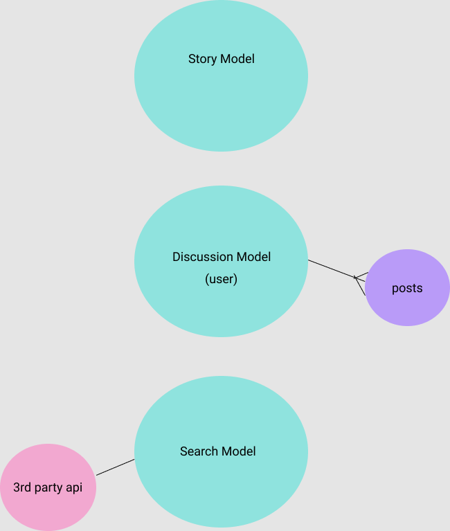
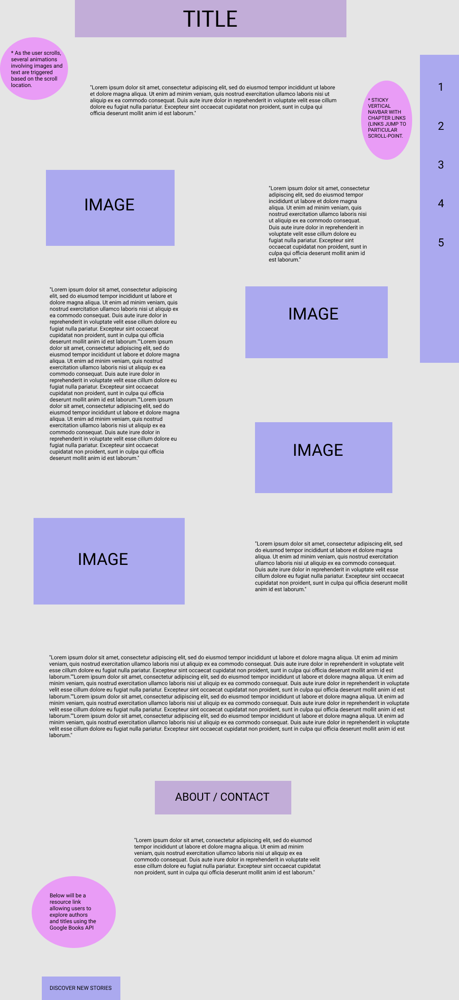

# SUBTLE MATTER

### DEPLOYED APP: https://subtl-matter.herokuapp.com
### TRELLO: https://trello.com/b/3CIrctRI/project4
-----

### BUILT WITH:

---

### DESCRIPTION:

#### Subtle Matter is a piece of short fiction in the form of a moving application. The reader navigates via a carousel and has the option of triggering audio cues to enhance the scene. Further exploration into the site reveals a discussion board as well as a book-search powered by <i>GoogleAPIs</i>.
------

### ERD:

------

### WIREFRAME:

